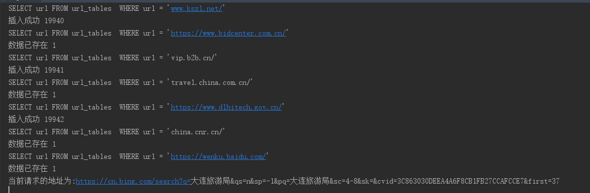
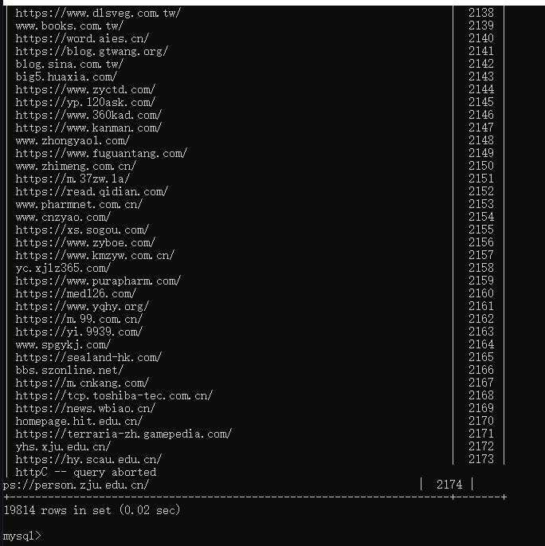

# collect-url-tools-base-keywords

**一款根据关键词批量采集url的工具，支持多个关键词，结果自动去重。**


## 支持的搜索引擎

| 搜索引擎   | 多线程 | 时间       |
| ---------- | ------ | ---------- |
| Bing国内版 | X      | 2022-03-22 |
| Bing国际版 | X      | 2022-03-22 |
|            |        |            |


## 快速上手

python3的环境，安装依赖包。

```bash
pip3 install -r requirements.txt
```

创建mysql数据库，将sql.sql文件导入进mysql

### detail

数据库结构

| 数据库名 | 表名       | 字段名1                    | 字段名2            |
| -------- | ---------- | -------------------------- | ------------------ |
| url      | url_tables | id(int, primary key, auto) | url(text, len(30)) |

启动

```bash
python3 main_tools.py
```


## 效果预览





## 更新消息

2022-03-22


* 支持bing国内搜索引擎，多线程会导致反爬
* 支持bing国际搜索引擎


